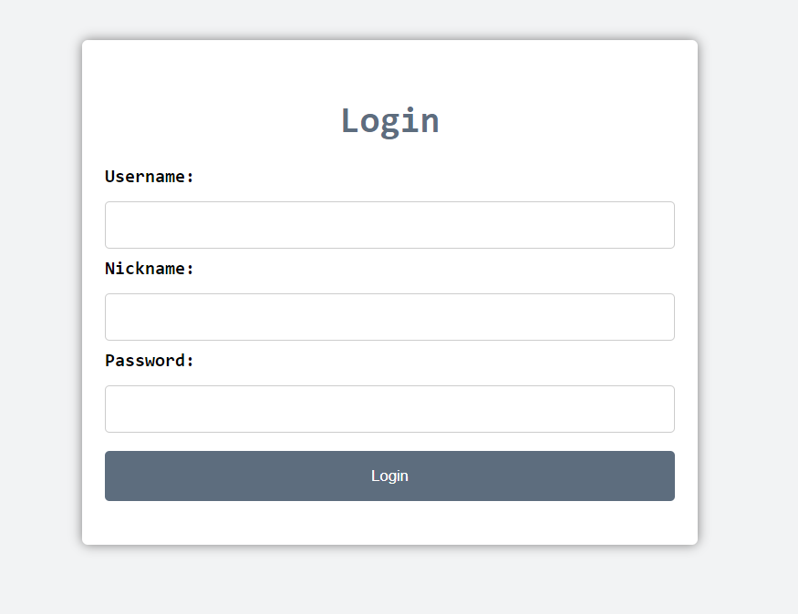

<h1>Telegram bot - <b style="color: red">Wakashi</b></h1>
<h3>Role game - immerse yourself in the culture of Japan</h3>

<h2>Available roles</h2>
<ul>
	<li><b style="color: #d5ffe6">Administrator</b> - creates all types of entities, cards, can bind card to other entities and get full information about entity</li>
	<li><b style="color: #d5ffe6">Shogun</b> - can get information about the slaves, create cards and bind them to Daimyo, get information about slaves</li>
	<li><b style="color: #d5ffe6">Daimyo</b> - can get all his cards, create replenishment request to collectors, can see the slaves list, get balances on the cards and can bind to Shogun</li>
	<li><b style="color: #d5ffe6">Samurai</b> - can get the turnover per shift, can bind to Daimyo</li>
	<li><b style="color: #d5ffe6">Collector</b> - handles Daimyo replenishment requests</li>
</ul>
<h2>Telegram greetings</h2>

<h2>Features</h2>
<ul>
	<li>Observability with graylog, prometheus</li>
    <li>Authorization server to make a start of microservice application (in the future)</li>
    <li>Authorization with sessions and tokens - to provide multiuser communications and secure data access</li>
    <li>Docker to containerize application</li>
    <li>Clean architecture pattern - every layer encapsulates all the logic inside, and every layer provides an interface to others in order to provide isolation</li>
</ul>

<h2>Usage</h2>
<h3>There is some examples of endpoints:</h3>
<ul>
    Default commands
    <li><code>/login password=your_password</code> - login endpoint</li>
    <li><code>/register password=your_password role=your_role</code>- register endpoint</li>
    <li><code>/status</code>- to get your status</li>
    <li><code>/exit</code>- to log out</li>
    <ul>You can also login using a web page. Just type "Login" to bot, or press Login button in /start panel and click on the Login link, don't forget to save your token (you can use it to reset the password)</ul>

Admin commands
<li><code>/admin_createCard number=4567344598433456 bank_id=1481 owner=tgUsername cvv=123</code> - create card</li>
<li><code>/admin_createEntity username=tgUsername password=qwerty role=shogun</code> - create entity</li>
<li><code>/admin_bindSlave master_username=... slave_username=...</code> - bind slave
<li><code>/admin_bindCard cardNumber=... username=...</code> - bind card to daimyo
<li><code>/admin_entityData username=...</code> - get entity data</li>

Shogun commands
<li><code>/shogun_getSlavesList </code> - get all the slaves</li>
<li><code>/shogun_createCard number=4567344598433456 bank_id=1481 owner=tgUsername cvv=123</code> -  create card</li>
<li><code>/shogun_getSlavesData slaveUsername=... </code> - get slave data

Daimyo commands
<li><code>/daimyo_getCards </code> - get all the slaves</li>
<li><code>/daimyo_increase number=4567344598433456 value=...</code> -  change the balance by value </li>
<li><code>/daimyo_getSamurai</code> - get all samurai slaves
<li><code>/daimyo_getTurnover samuraiUsername=... </code> - get turnover of samurai in current shift
<li><code>/daimyo_getCardsTotal </code> -get the summary balance on cards
<li><code>/daimyo_bindShogun shogunUsername=... </code> - bind yourself to shogun

Samurai commands
<li><code>/samurai_getTurnover</code> - get your turnover</li>
<li><code>/samurai_bindDaimyo daimyoUsername...</code> - bind yourself to daimyo</li>

Shogun commands
<li><code>/collector_performInc requestID=...</code> - handle the request</li>
<li><code>/collector_showTransactions</code> -  get all unhandled transactions</li>

</ul>
<h2>Contributing</h2>

If you want to contribute to this project, please follow these steps:

<ol>
	<li>Fork this repository</li>
	<li>Create a new branch for your changes</li>
	<li>Make your changes and commit them</li>
	<li>Push your changes to your forked repository</li>
	<li>Create a pull request</li>
</ol>

<h2>Links</h2>
Telegram bot link: https://t.me/InternTestTaskBot
<h2>Contact</h2>

If you have any questions or suggestions, please feel free to contact me at <a href="mailto:markusa.study@mail.ru">markusa.study@mail.ru</a>.
